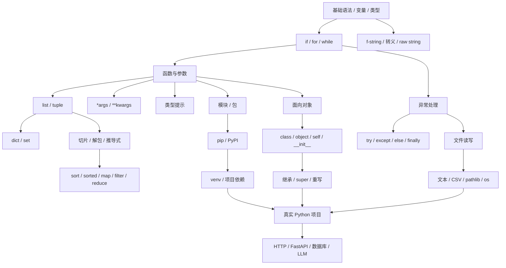

---
tags:
  - python/导航
---

# Python 知识图谱

返回 [[00 Python学习导航]]。



## 稳定问题映射

```text
遍历数据         → for
筛选数据         → if / filter / 推导式
转换数据         → 表达式 / map
排序数据         → sort / sorted
累计结果         → 累加器 / reduce
键值对应         → dict
去重与集合关系   → set
不固定位置参数   → *args
不固定关键字参数 → **kwargs
运行时失败       → try / except
拆分代码         → module / package
第三方依赖       → pip
项目隔离         → venv
外部数据         → 文件 / CSV / JSON
路径操作         → pathlib / os
对象建模         → class
```

## Day05 主线

[[week01/day05/Day05 函数参数、异常与模块|Day05 函数参数、异常与模块]]

```text
函数参数
→ *args / **kwargs / 解包
→ 异常处理
→ 模块 / 包
→ 类型提示
```

## Day06 主线

[[week01/day06/Day06 文件处理、环境与面向对象|Day06 文件处理、环境与面向对象]]

```text
f-string / raw string
→ 文件读写
→ CSV
→ pathlib / os
→ pip / venv
→ class / object
→ inheritance
```

## OOP 快速映射

```text
class       → 类 / 模板
object      → 对象 / 实例
__init__    → 初始化实例
self        → 当前实例
attribute   → 属性
method      → 方法
inheritance → 继承
super()     → 调用父类实现
override    → 方法重写
```

到 Day06 为止，Python 基础骨架已经够用了。接下来判断标准应该从“有没有看过这个语法”变成：

> 实际问题出现时，我能不能知道该用哪个工具？