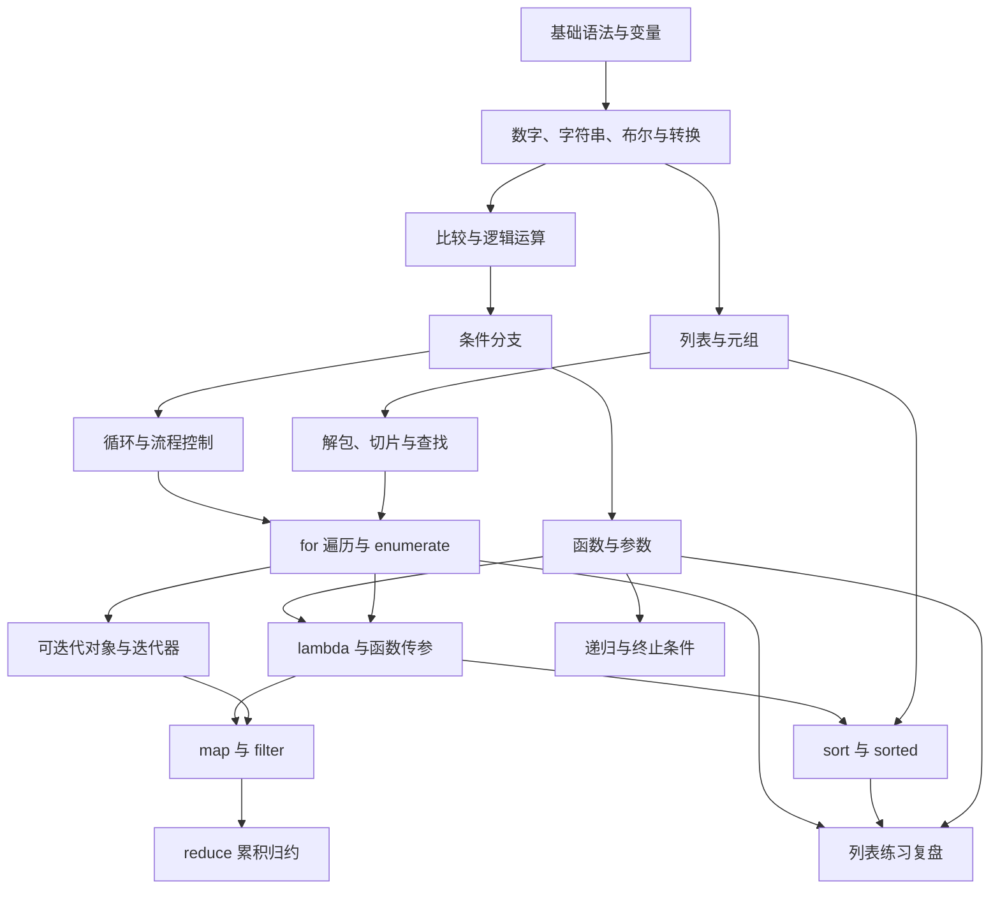

---
tags:
  - python/导航
---

# Python 知识图谱

返回 [[00 Python学习导航]]。箭头表示“先掌握左边，更容易理解右边”；平行分支不必按唯一顺序学习。下图是概览，后面的双向链接可以直接打开笔记。

## 1. 值 → 条件 → 分支

[[python变量|Python 变量]] → [[python数字|Python 数字]] → [[python算术|Python 算术运算符]] → [[python赋值操作符|Python 复合赋值运算符]]

[[python变量|Python 变量]] → [[python字符串|Python 字符串]] → [[类型转换|Python 类型转换]]

[[python布尔|Python 布尔值与真值判断]] → [[python比较|Python 比较运算符]] → [[Python 逻辑运算符|Python 逻辑运算符]] → [[python if语句|Python if 条件分支]] → [[Python三进制算符|Python 三元表达式（条件表达式）]]

## 2. 重复执行 → 遍历数据

[[Python范围循环|Python for 与 range]] → [[Python 列表|Python 列表]] → [[For 循环|Python for 遍历列表与 enumerate]] → [[Python 迭代|Python 可迭代对象与迭代器]]

[[Python while|Python while 循环]] 与 [[Python范围循环|Python for 与 range]] 是两种循环方式；循环内的跳转见 [[Python break|Python break]]、[[Python continue|Python continue]]。[[Python pass|Python pass]] 只用于占位。

## 3. 序列 → 位置与结构

[[python字符串|Python 字符串]] → [[Python 列表|Python 列表]] → [[Python元组|Python 元组]] → [[Python 中解包列表|Python 序列解包]]

从 [[Python 列表|Python 列表]] 分出 [[Python 列表切片|Python 列表切片]] 和 [[查找列表中元素的索引|Python 列表查找与成员判断]]；解包又连接到 [[For 循环|Python for 遍历列表与 enumerate]] 中的 `(index, item)`。

## 4. 函数 → 把行为传进去

[[Python 函数|Python 函数]] → [[Python 默认参数|Python 默认参数]] → [[Python 关键词参数|Python 关键字参数]] → [[Python Lambda表达式|Python lambda 表达式]]

文档分支：[[python注释|Python 注释]] → [[Python 函数文档字符串|Python 函数文档字符串]]。递归分支：[[Python 函数|Python 函数]] + [[python if语句|Python if 条件分支]] → [[Python 递归函数|Python 递归函数]]。

## 5. 一批数据 → 排序、转换、筛选与归约

| 想完成的任务 | 对应笔记 | 与已有知识的连接 |
| --- | --- | --- |
| 修改原列表的顺序 | [[Python 排序列表|Python list.sort 原地排序]] | 列表 + key 函数 |
| 得到新排序列表 | [[Python sorted|Python sorted 返回新列表]] | 与原地排序对照 |
| 逐项转换 | [[Python map（） 函数转换列表元素|Python map 转换元素]] | for + 函数 + 迭代器 |
| 按条件保留元素 | [[Python中筛选列表元素|Python filter 筛选元素]] | for + if + 迭代器 |
| 多项累积成一个结果 | [[Python的reduce（） 函数将列表简化为单一值|Python reduce 累积归约]] | 累加器 + 双参数函数 |

## 6. 用自己的错题检验知识链

[[今日练习|打开原练习记录]] → [[02 易混概念与练习复盘|按错误类型回查知识]]。

Obsidian 的关系图谱会读取笔记中的 双向链接。打开任意主题的“局部关系图”可以看相邻概念；本页的 Mermaid 图用于解释方向，真正可点击的知识关系由正文与各篇的双向链接提供。图谱里的导航链接、前后篇链接不全是严格的依赖，判断依赖时以“前置知识”为准。
