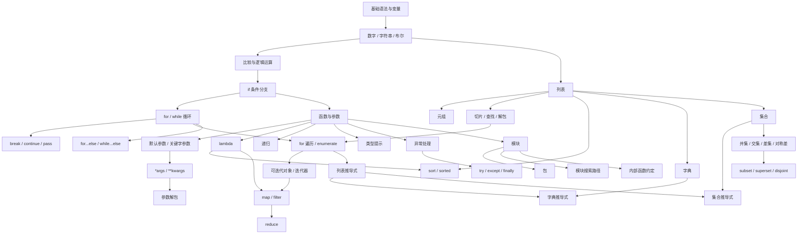

---
tags:
  - python/导航
---

# Python 知识图谱

返回 [[00 Python学习导航]]。

下面的箭头表示“前面的知识更适合作为后面的基础”，不是死板课程顺序。



## 1. 基础值与条件

[[python变量|变量]] → [[python数字|数字]] / [[python字符串|字符串]] / [[python布尔|布尔]] → [[python比较|比较]] → [[Python 逻辑运算符|逻辑运算]] → [[python if语句|if]]

## 2. 循环与流程控制

[[Python范围循环|for + range]]、[[Python while|while]] → [[Python break|break]] / [[Python continue|continue]] / [[Python pass|pass]]

理解 `break` 后，再学习 [[Python for…else|for...else]] 和 [[Python while else|while...else]] 会更自然。

## 3. 函数与参数

[[Python 函数|函数]] → [[Python 默认参数|默认参数]] → [[Python 关键词参数|关键字参数]]

继续向下：

```text
固定数量参数
→ 不固定位置参数 *args
→ 不固定关键字参数 **kwargs
→ 调用时使用 * / ** 解包
```

关联：[[week01/day05/Python args|*args]]、[[week01/day05/Python kwargs|**kwargs]]、[[week01/day05/Python 解包元组|解包]]。

分支知识：[[Python Lambda表达式|lambda]]、[[Python 递归函数|递归函数]]、[[week01/day05/Python 类型提示|类型提示]]。

## 4. 列表与序列

[[Python 列表|列表]] → [[Python元组|元组]] → [[Python 中解包列表|序列解包]]

从列表继续分出：
- [[Python 列表切片|切片]]
- [[查找列表中元素的索引|成员判断与 index]]
- [[For 循环|for 遍历 / enumerate]]
- [[Python 列表解析|列表推导式]]

## 5. 迭代与数据处理

[[Python 迭代|迭代器]] 是理解 `map()` / `filter()` 返回值的重要前置。

| 目标 | 工具 | 重点 |
| --- | --- | --- |
| 原地排序列表 | [[Python 排序列表|list.sort()]] | 修改原列表，返回 `None` |
| 得到新排序结果 | [[Python sorted|sorted()]] | 返回新列表 |
| 转换每个元素 | [[Python map（） 函数转换列表元素|map()]] | `map(fn, iterable)` |
| 按条件筛选 | [[Python中筛选列表元素|filter()]] | `filter(fn, iterable)` |
| 多值归约成一个值 | [[Python的reduce（） 函数将列表简化为单一值|reduce()]] | 来自 `functools` |

Day03 主线：[[week01/day03/Day03 列表与迭代|Day03 列表与迭代]]。

## 6. 字典

[[Python 词典|字典]] 的核心是 `key -> value`。

```text
读取 / get()
→ 新增与修改
→ del
→ keys() / values() / items()
→ for key, value in dict.items()
→ 字典推导式
```

关联：[[Python 词典理解|字典推导式]]。

## 7. 集合

[[Python 集合|集合]] 的核心价值：**去重、成员判断、集合关系运算**。

```text
set
├── union 并集
├── intersection 交集
├── difference 差集
├── symmetric_difference 对称差
├── issubset 子集
├── issuperset 超集
└── isdisjoint 不相交
```

Day04 主线：[[week01/day04/Day04 字典与集合|Day04 字典与集合]]。

## 8. 异常处理

程序不仅会有“代码写错”，还会遇到运行时失败：

```text
输入格式错误
文件不存在
除以 0
API 请求失败
JSON 解析失败
```

对应主线：

```text
try
→ except 捕获指定异常
→ finally 做清理动作
```

关联：[[week01/day05/Python try…except|try...except]]、[[week01/day05/Python try…except…finally|finally]]。

## 9. 模块与包

代码变多以后，需要从“会写函数”进入“会组织代码”：

```text
一个 .py 文件
→ module 模块

多个相关模块放入目录
→ package 包
```

继续关联：

```text
import 找模块
→ sys.path 模块搜索路径

_函数名
→ 表示内部实现的约定
```

Day05 主线：[[week01/day05/Day05 函数参数、异常与模块|Day05 函数参数、异常与模块]]。

## 10. 当前最需要形成的能力

不要一次记住全部方法，而是把问题映射到稳定模式：

```text
遍历数据           → for
筛选数据           → if / filter / 推导式
转换数据           → 表达式 / map
排序数据           → sort / sorted
累计结果           → 累加器 / reduce
按键保存数据       → dict
去重与集合关系     → set
不固定位置参数     → *args
不固定关键字参数   → **kwargs
运行时失败处理     → try / except
拆分代码文件       → module / package
说明输入输出类型   → type hints
```

真正的检验方式仍然是 [[02 易混概念与练习复盘]] + 手写代码。
