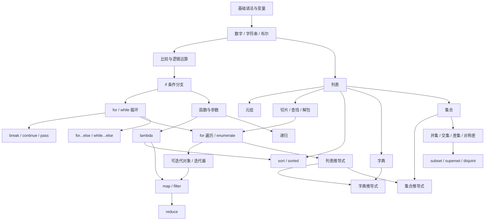

---
tags:
  - python/导航
---

# Python 知识图谱

返回 [[00 Python学习导航]]。

下面的箭头表示“前面的知识更适合作为后面的基础”，不是死板课程顺序。



## 1. 基础值与条件

[[python变量|变量]] → [[python数字|数字]] / [[python字符串|字符串]] / [[python布尔|布尔]] → [[python比较|比较]] → [[Python 逻辑运算符|逻辑运算]] → [[python if语句|if]]

## 2. 循环与流程控制

[[Python范围循环|for + range]]、[[Python while|while]] → [[Python break|break]] / [[Python continue|continue]] / [[Python pass|pass]]

在理解 `break` 后，再学习 [[Python for…else|for...else]] 和 [[Python while else|while...else]] 会更自然。

## 3. 函数

[[Python 函数|函数]] → [[Python 默认参数|默认参数]] → [[Python 关键词参数|关键字参数]] → [[Python Lambda表达式|lambda]]

分支知识：[[Python 递归函数|递归函数]]。

## 4. 列表与序列

[[Python 列表|列表]] → [[Python元组|元组]] → [[Python 中解包列表|序列解包]]

从列表继续分出：
- [[Python 列表切片|切片]]
- [[查找列表中元素的索引|成员判断与 index]]
- [[For 循环|for 遍历 / enumerate]]
- [[Python 列表解析|列表推导式]]

## 5. 迭代与数据处理

[[Python 迭代|迭代器]] 是理解 `map()` / `filter()` 返回值的重要前置。

| 目标 | 工具 | 重点 |
| --- | --- | --- |
| 原地排序列表 | [[Python 排序列表|list.sort()]] | 修改原列表，返回 None |
| 得到新排序结果 | [[Python sorted|sorted()]] | 返回新列表 |
| 转换每个元素 | [[Python map（） 函数转换列表元素|map()]] | `map(fn, iterable)` |
| 按条件筛选 | [[Python中筛选列表元素|filter()]] | `filter(fn, iterable)` |
| 多值归约成一个值 | [[Python的reduce（） 函数将列表简化为单一值|reduce()]] | 来自 functools |

Day03 的整理入口：[[week01/day03/00 Day03整理版|Day03 整理版]]。

## 6. 字典

[[Python 词典|字典]] 的核心是 `key -> value`。

常用能力：

```text
读取 / get()
→ 新增与修改
→ del
→ keys() / values() / items()
→ for key, value in dict.items()
→ 字典推导式
```

关联：[[Python 词典理解|字典推导式]]。

## 7. 集合

[[Python 集合|集合]] 的核心价值：**去重、快速成员判断、集合关系运算**。

```text
set
├── union 并集
├── intersection 交集
├── difference 差集
├── symmetric_difference 对称差
├── issubset 子集
├── issuperset 超集
└── isdisjoint 不相交
```

关联：[[Python集合合并]]、[[Python 集交集]]、[[Python集合差集]]、[[Python 对称差分]]、[[Python issubset]]、[[Python issuperset]]、[[Python 不相交集]]。

Day04 的整理入口：[[week01/day04/00 Day04整理版|Day04 整理版]]。

## 8. 当前最需要形成的能力

你的目标不是一次记住全部方法，而是把知识变成几个稳定模式：

```text
遍历数据 → for
筛选数据 → if / filter / 推导式
转换数据 → 表达式 / map
排序数据 → sort / sorted
累计结果 → 累加器 / reduce
按键保存数据 → dict
去重与集合关系 → set
查找失败后做兜底 → for...else
```

真正的检验方式仍然是 [[02 易混概念与练习复盘]] + 手写代码。
